# Architecture & Submission Flow

This document describes the end-to-end architecture of Collective Will — from user
onboarding through submission, AI processing, community voting, and public results.
Every action is recorded in an append-only evidence hash-chain for transparency.

---

## High-Level System Overview


---

## 1. User Onboarding

A user must complete two verification steps before they can submit or vote: email
verification (via magic link) and messaging account linking (via Telegram).

```mermaid
sequenceDiagram
    participant U as User
    participant W as Website
    participant B as Backend (FastAPI)
    participant E as Resend (Email)
    participant T as Telegram Bot

    Note over U,T: Step 1 — Email Verification
    U->>W: Visit landing page, enter email
    W->>B: POST /auth/subscribe {email, locale}
    B->>B: Rate-limit checks (domain, IP)
    B->>B: Create/get User record
    B->>B: Generate magic_link token (15 min TTL)
    B->>E: Send magic link email
    E-->>U: Email with verification link

    U->>W: Click magic link → /verify?token=T
    W->>B: POST /auth/verify/{token}
    B->>B: Validate token, mark email_verified=true
    B->>B: Generate linking_code (8 chars, 60 min TTL)
    B->>B: Generate web_session_code (24 chars, 10 min TTL)
    B-->>W: {linking_code, email, web_session_code}
    W->>W: NextAuth signIn → establish session cookie

    Note over U,T: Step 2 — Telegram Account Linking
    U->>T: Send linking_code as text message
    T->>B: Webhook → route_message()
    B->>B: User not found by sender_ref → try resolve_linking_code()
    B->>B: Validate code, set messaging_verified=true
    B->>B: Assign opaque messaging_account_ref (UUIDv4)
    B->>B: Set messaging_account_age = now
    B->>B: Log "user_verified" to evidence chain
    B-->>T: Welcome message + main menu (inline keyboard)
```



### Eligibility Timeline

After linking, the user must wait **48 hours** (configurable via `MIN_ACCOUNT_AGE_HOURS`)
before submitting or voting. This deters rapid Sybil account creation.

### Token Types

| Token | Purpose | TTL | Storage |
|-------|---------|-----|---------|
| `magic_link` | Email verification URL | 15 min | `verification_tokens` DB |
| `linking_code` | Telegram account linking | 60 min | `verification_tokens` DB |
| `web_session` | One-time exchange for bearer token | 10 min | `verification_tokens` DB |
| Bearer token | Authenticated API access | 30 days | Signed JWT cookie |

---

## 2. Submission Intake

When a user submits a concern via Telegram, the system runs eligibility checks, PII
detection, and inline AI canonicalization — all in a single request path.

```mermaid
flowchart TD
    MSG["User sends text message via Telegram"]
    CMD["route_message() — command router"]
    STATE{"User bot_state?"}
    AWAIT["bot_state = awaiting_submission"]
    MENU["Show main menu"]

    ELIG{"Eligible?\n(email_verified +\nmessaging_verified +\naccount_age ≥ 48h)"}
    RATE{"Daily limit OK?\n(≤ 5 / day)"}
    PII{"High-risk PII\ndetected?"}
    STORE["Create Submission record\n(status: pending)"]
    BURST{"Burst check\n(≥ 3 in 5 min?)"}
    QUARANTINE["Set status: quarantined"]
    LOG_RECV["Evidence: submission_received"]

    CANON_LLM["Canonicalize via LLM\n(Claude Sonnet → Gemini fallback)"]
    VALID{"is_valid_policy?"}

    REJECT["Status: rejected\nEvidence: submission_rejected_not_policy\nSend rejection reason (user's language)"]
    BUILD["Build PolicyCandidate\n(title, summary, stance,\npolicy_topic, policy_key)"]
    EVIDENCE_CAND["Evidence: candidate_created"]
    EMBED_STEP["Compute embedding\n(Gemini → OpenAI fallback)"]
    STATUS_OK["Status: canonicalized"]
    CONFIRM["Send confirmation + analytics link"]
    FAIL_INLINE["Exception → status: pending\nDefer to batch"]

    MSG --> CMD --> STATE
    STATE -->|awaiting_submission| AWAIT --> ELIG
    STATE -->|other/none| MENU

    ELIG -->|No| MENU
    ELIG -->|Yes| RATE
    RATE -->|Exceeded| MENU
    RATE -->|OK| PII
    PII -->|Yes| MENU
    PII -->|No| STORE
    STORE --> BURST
    BURST -->|Yes| QUARANTINE --> LOG_RECV
    BURST -->|No| LOG_RECV
    LOG_RECV --> CANON_LLM
    CANON_LLM --> VALID
    CANON_LLM -->|Exception| FAIL_INLINE

    VALID -->|No| REJECT
    VALID -->|Yes| BUILD --> EVIDENCE_CAND --> EMBED_STEP --> STATUS_OK --> CONFIRM
```



### Abuse Controls at Intake

| Control | Threshold | Action |
|---------|-----------|--------|
| Daily submission limit | 5 per account per day | Block with message |
| Burst detection | ≥ 3 submissions in 5 min | Accept but set status `quarantined` |
| PII detection | Email/phone regex match | Block, ask user to redact |

Rejected submissions (not-policy, PII) count against the daily limit. The submission
record is created before canonicalization runs, so all attempts — successful or not —
consume quota. This is intentional to deter spam and probing.

---

## 3. AI Canonicalization

The canonicalization step is the core AI transformation. It converts free-text user input
(in any language, typically Farsi) into a structured English policy candidate.

### What the LLM Receives

1. **System prompt**: Role as a civic submission processor
2. **User prompt** containing:
   - The sanitized submission text (PII-redacted, metadata stripped, randomly ordered)
   - Existing policy context (all current clusters with topics, keys, and member counts)
   - Rules for validity, language, stance detection, and policy key assignment

### What the LLM Returns (JSON)

```json
{
  "is_valid_policy": true,
  "rejection_reason": null,
  "title": "5-15 word English title",
  "summary": "1-3 sentence English summary",
  "stance": "support|oppose|neutral|unclear",
  "policy_topic": "umbrella-topic",
  "policy_key": "specific-ballot-level-key",
  "entities": ["Entity1", "Entity2"],
  "confidence": 0.85,
  "ambiguity_flags": []
}
```

### Privacy Pipeline (`pipeline/privacy.py`)

Before any text reaches the LLM:

1. **Strip metadata**: Remove `id`, `user_id`, `email`, `wa_id`, `ip`, and any `*_id` keys
2. **Redact PII**: Regex-replace emails and phone numbers with `[REDACTED]`
3. **Shuffle order**: Randomize batch item order to prevent position-based inference
4. **Validate**: Assert no metadata or PII patterns remain

### LLM Routing (`pipeline/llm.py`)

All LLM calls go through `LLMRouter`, which provides:

- **Tier-based model selection**: Each task tier (`canonicalization`, `english_reasoning`,
  `option_generation`, etc.) has a primary and fallback model configured via env vars
- **Automatic fallback**: If the primary model fails, the fallback is tried
- **Retry with backoff**: Transient HTTP errors trigger exponential backoff retries
- **Provider abstraction**: Same interface for Anthropic, Google, OpenAI, DeepSeek, Mistral
- **Cost tracking**: Per-call cost estimation aggregated on the router instance

| Tier | Primary | Fallback | Used For |
|------|---------|----------|----------|
| `canonicalization` | Claude Sonnet 4.6 | Gemini 3.1 Pro | Submission → structured candidate |
| `english_reasoning` | Claude Sonnet 4.6 | Gemini 3.1 Pro | Ballot questions, normalization |
| `option_generation` | Claude Sonnet 4.6 | Gemini 3.1 Pro (+ Google Search grounding) | Per-policy stance options |
| `farsi_messages` | Claude Sonnet 4.6 | Gemini 3.1 Pro | User-facing Farsi messages |
| `dispute_resolution` | Claude Sonnet 4.6 | Gemini 3.1 Pro | Dispute re-canonicalization |

---

## 4. Embedding & Clustering

After canonicalization, the system computes vector embeddings and groups candidates by
their LLM-assigned `policy_key`.

### Embedding Generation (`pipeline/embeddings.py`)

- **Input**: `"{title}\n\n{summary}"` concatenation
- **Model**: Gemini `gemini-embedding-001` (primary), OpenAI `text-embedding-3-large` (fallback)
- **Storage**: pgvector column on `PolicyCandidate`
- **Batching**: Up to 64 items per batch API call

### Policy-Key Grouping (`pipeline/cluster.py`)

Candidates are grouped into `Cluster` records by their `policy_key` (assigned during
canonicalization). This is a deterministic grouping — the LLM assigns each submission a
stance-neutral key at canonicalization time, and all candidates sharing a key form a
cluster.


---

## 5. Hybrid Normalization (Cross-Topic Merge)

Periodically, the system runs normalization to discover and merge near-duplicate policy
keys that the LLM may have assigned inconsistently across submissions.

```mermaid
flowchart TD
    LOAD["Load all candidates with embeddings"]
    COSINE["Agglomerative clustering\non cosine distance\n(threshold: 0.55)"]
    GROUPS["Group candidates by\nembedding cluster"]
    MULTI{"Cluster has ≥ 2\ndistinct policy_keys?"}
    SKIP["Skip — keys are consistent"]
    LLM["Send all summaries to LLM\n(english_reasoning tier)\nAsk for canonical key mapping"]
    PARSE["Parse {old_key → canonical_key}\nmapping"]
    MERGE["Execute merge:\n• Move candidates to survivor key\n• Merge cluster records\n• Evidence: cluster_merged\n• Delete merged cluster\n• Set needs_resummarize = true"]

    LOAD --> COSINE --> GROUPS --> MULTI
    MULTI -->|No| SKIP
    MULTI -->|Yes| LLM --> PARSE --> MERGE
```



### Merge Operation Detail

When keys are merged:

1. All `PolicyCandidate` rows with the old key are updated to the survivor key
2. The survivor `Cluster`'s `candidate_ids` absorbs the merged cluster's candidates
3. An `cluster_merged` evidence entry is appended
4. The merged `Cluster` record is deleted
5. The survivor cluster is flagged `needs_resummarize = true`

---

## 6. Batch Scheduler (`src/scheduler/`)

The batch pipeline is orchestrated by `run_pipeline()` in `src/scheduler/main.py`, run
as a standalone process via `src/scheduler/__main__.py`.

### What It Does (in order)

1. Fetch all `canonicalized` and `pending` submissions
2. Batch-canonicalize any `pending` submissions (recovery for inline LLM failures)
3. Compute missing embeddings for candidates without vectors
4. Group candidates by `policy_key` — create new `Cluster` records or update existing ones
5. Run hybrid normalization — merge near-duplicate policy keys across topics
6. Generate ballot questions for clusters with `needs_resummarize = true`
7. Generate policy options for qualified clusters that don't have options yet
8. Build agenda — check endorsement threshold for ballot qualification
9. Mark all processed submissions as `status = "processed"`
10. Compute daily Merkle root for external anchoring
11. Update the `scheduler_heartbeat` table for ops monitoring

### Current Trigger: Time-Based

The scheduler runs on a fixed interval: `PIPELINE_INTERVAL_HOURS` (default 6h). Each
iteration calls `run_pipeline()` then sleeps. An `asyncio.Lock` prevents concurrent runs.

### Planned: Hybrid Trigger

The scheduler will be changed to a hybrid model: trigger when unprocessed submissions
reach a count threshold **or** when the max time interval elapses, whichever comes first.
See `docs/tickets/hybrid-scheduler-trigger.md` for details.

---

## 7. Ballot Question & Policy Option Generation

After clustering and normalization, clusters that need new or updated summaries go through
two LLM generation steps.

### Ballot Question Generation (`pipeline/endorsement.py`)

For each cluster with `needs_resummarize = true`:

1. Gather all member submissions (title, summary, stance)
2. Send to LLM (`english_reasoning` tier) asking for:
   - A stance-neutral ballot question (English + Farsi)
   - A short neutral summary
3. Update the cluster and log `ballot_question_generated` to evidence

### Policy Option Generation (`pipeline/options.py`)

For each cluster:

1. Build a prompt with the cluster's topic, summary, and sample member submissions
2. Request 2–4 distinct stance options from the LLM (`option_generation` tier)
3. **Web grounding**: When the fallback Gemini model is used, Google Search grounding
   activates automatically to incorporate real-world policy context
4. Each option includes: Farsi label, English label, Farsi description (pros/cons),
   English description
5. Persist as `PolicyOption` rows and log `policy_options_generated`
6. **Fallback**: If LLM generation fails, a minimal support/oppose pair is created


---

## 8. Endorsement & Agenda Building

Before a cluster can appear on a voting ballot, it must pass a pre-ballot endorsement
threshold.

### Pre-Ballot Endorsement

- Users can **endorse** clusters via Telegram inline buttons
- Each endorsement is logged as `policy_endorsed` in the evidence chain
- Endorsements count toward a combined support threshold

### Agenda Builder (`pipeline/agenda.py`)

The agenda builder determines which clusters qualify for the voting ballot:

```
total_support = member_count (submissions) + endorsement_count
qualifies = total_support ≥ MIN_PREBALLOT_ENDORSEMENTS (default: 5)
```

Clusters that qualify are included in the next voting cycle.

---

## 9. Voting Cycle

Voting is a **per-policy stance selection** flow conducted via Telegram's inline keyboard.

```mermaid
sequenceDiagram
    participant U as User (Telegram)
    participant B as Bot / Backend

    U->>B: Tap "🗳️ Vote" button
    B->>B: Find active VotingCycle
    B->>B: Initialize vote session in bot_state_data
    B-->>U: Policy 1 of N: summary + 2-4 stance options

    loop For each policy
        alt User selects an option
            U->>B: Tap option (e.g., "A. Full support")
            B->>B: Record selection in session
            B-->>U: Next policy (or summary if last)
        else User skips
            U->>B: Tap "⏭️ Skip"
            B->>B: Mark as skipped
            B-->>U: Next policy
        else User goes back
            U->>B: Tap "⬅️ Previous"
            B-->>U: Previous policy
        end
    end

    B-->>U: Summary of all selections
    U->>B: Tap "✅ Submit vote"
    B->>B: Eligibility check (verified + age + contribution)
    B->>B: Vote change limit check (max 2 per cycle)
    B->>B: Create Vote record with selections
    B->>B: Evidence: vote_cast
    B-->>U: "✅ Your vote has been recorded!" + analytics link
```



### Vote Eligibility

| Requirement | Default |
|-------------|---------|
| Email verified | Required |
| Messaging verified | Required |
| Account age | ≥ 48 hours |
| Prior contribution | `contribution_count` ≥ 1 |
| Vote changes per cycle | Max 2 total submissions |

`contribution_count` increments by +1 on each successfully canonicalized submission (inline
or batch) and +1 on each policy endorsement.

### Cycle Lifecycle


> **Note**: The schema also defines a `closed` status, but it is currently unused.
> `close_and_tally()` transitions directly from `active` to `tallied` in one atomic
> operation. Automatic detection of expired cycles (`ends_at` passed) is not yet wired
> into the scheduler — see `docs/tickets/auto-close-expired-voting-cycles.md`.

1. **Open**: `open_cycle()` creates a `VotingCycle` with qualified cluster IDs and a
   configurable duration (`VOTING_CYCLE_HOURS`, default 48h). Evidence: `cycle_opened`.
2. **Active**: Users vote via Telegram. Reminders sent to non-voters.
3. **Close & Tally**: `close_and_tally()` counts votes per cluster, computes
   per-option counts, sets `status = "tallied"`. Evidence: `cycle_closed`.

---

## 10. Evidence Hash-Chain

Every significant action in the system is recorded as an immutable, hash-linked entry
in the `evidence_log` table.


### How It Works

Each entry's hash is computed over a canonical JSON of:

```
SHA-256({timestamp, event_type, entity_type, entity_id, payload, prev_hash})
```

- **Genesis**: The first entry uses `prev_hash = "genesis"`
- **Serialization lock**: PostgreSQL advisory lock prevents concurrent writers from
  reusing the same `prev_hash`
- **Verification**: `verify_chain()` replays the full chain and checks every hash
- **Daily Merkle root**: Computed for external anchoring (Witness.co, config-driven)

### Event Types

| Event | When |
|-------|------|
| `submission_received` | User submits text (including PII rejections) |
| `submission_rejected_not_policy` | LLM determines submission is not policy-related |
| `candidate_created` | Successful canonicalization produces a PolicyCandidate |
| `cluster_created` | New cluster formed from policy_key grouping |
| `cluster_updated` | Cluster membership or summary changed |
| `cluster_merged` | Normalization merged two clusters |
| `ballot_question_generated` | LLM generated ballot question for a cluster |
| `policy_options_generated` | LLM generated stance options for a cluster |
| `policy_endorsed` | User endorsed a cluster for ballot inclusion |
| `vote_cast` | User submitted a vote |
| `cycle_opened` | New voting cycle started |
| `cycle_closed` | Voting cycle tallied and closed |
| `user_verified` | Email verification or messaging account linking |
| `dispute_resolved` | Dispute re-canonicalization completed |
| `dispute_escalated` | Dispute escalated to stronger model/ensemble |
| `dispute_metrics_recorded` | Periodic dispute volume/disagreement metrics logged |
| `dispute_tuning_recommended` | Dispute rate exceeds threshold, flagging for prompt/policy tuning |
| `anchor_computed` | Daily Merkle root computed |

### Public Evidence API

- `GET /analytics/evidence` — Paginated, filterable by `entity_id` and `event_type`.
  PII keys (`user_id`, `email`, `account_ref`, `wa_id`) are stripped from payloads.
- `GET /analytics/evidence/verify` — Server-side chain integrity verification.

---

## 11. Channel Architecture

The system is channel-agnostic. All messaging platforms implement the `BaseChannel`
abstract interface:

```
BaseChannel (ABC)
├── send_message(OutboundMessage) → bool
├── parse_webhook(payload) → UnifiedMessage | None
├── answer_callback(callback_query_id) → bool
└── edit_message_markup(recipient_ref, message_id, reply_markup) → bool
```

| Platform | Implementation | Status |
|----------|---------------|--------|
| Telegram | `TelegramChannel` (Bot API) | Active (MVP) |
| WhatsApp | `WhatsAppChannel` (Evolution API) | Prepared, deferred to post-MVP |

All business logic operates on `UnifiedMessage` and `OutboundMessage` — never on
platform-specific payload formats. This means swapping or adding a transport is a
single-module change.

---

## 12. Dispute Handling

Users can flag bad canonicalization or cluster assignment from their web dashboard.

- The dispute triggers an autonomous re-canonicalization pipeline (not human review)
- The dispute resolver uses the `dispute_resolution` LLM tier
- If confidence is low, it escalates to a stronger model or multi-model ensemble
- Resolution is scoped to the disputed submission — no full re-clustering
- Evidence logged: `dispute_resolved`, optionally `dispute_escalated`
- SLA target: 72 hours
- If disputes exceed 5% of cycle submissions, the system flags for policy/prompt tuning

---

## 13. Web Surfaces

### Public (no auth required)

| Page | Route | Data Source |
|------|-------|-------------|
| Landing / Subscribe | `/{locale}/` | — |
| Top Policies | `/{locale}/analytics/top-policies` | `GET /analytics/top-policies` |
| Cluster Explorer | `/{locale}/analytics/clusters` | `GET /analytics/clusters`, `/clusters/{id}` |
| Evidence Explorer | `/{locale}/analytics/evidence` | `GET /analytics/evidence`, `/evidence/verify` |
| Stats | — | `GET /analytics/stats` |

### Authenticated

| Page | Route | Data Source |
|------|-------|-------------|
| Dashboard | `/{locale}/dashboard` | `GET /user/submissions`, `/user/votes` |
| Dispute Filing | `/{locale}/dashboard` | `POST /user/disputes` |

### Ops Console (admin)

| Page | Route | Gating |
|------|-------|--------|
| Ops Dashboard | `/{locale}/ops` | `OPS_CONSOLE_ENABLED` + admin auth in production |

---

## 14. Complete Lifecycle — One Submission

Putting it all together, here is one submission's journey from user to public ballot:


---

## Data Model Summary


| Model | Key Fields |
|-------|-----------|
| `User` | email, email_verified, messaging_verified, messaging_account_ref, locale, contribution_count, bot_state |
| `Submission` | user_id, raw_text, language, status (pending / canonicalized / processed / rejected / quarantined), hash |
| `PolicyCandidate` | submission_id, title, summary, stance, policy_topic, policy_key, embedding, confidence |
| `Cluster` | policy_key, summary, ballot_question, candidate_ids, member_count, needs_resummarize |
| `PolicyOption` | cluster_id, position, label (fa), label_en, description (fa), description_en |
| `PolicyEndorsement` | user_id, cluster_id |
| `VotingCycle` | status (active / tallied; `closed` reserved but unused), cluster_ids, results, total_voters |
| `Vote` | user_id, cycle_id, selections [{cluster_id, option_id}] |
| `EvidenceLogEntry` | event_type, entity_id, payload, hash, prev_hash |
