# Submission Pipeline: End-to-End Flow

This document traces what happens to a single user submission from the moment
it arrives through to its appearance on a voting ballot.

---

## Overview

A submission passes through two distinct phases:

1. **Inline Phase** — runs synchronously during the user's Telegram request
2. **Batch Phase** — runs periodically via the scheduler (every ~6 hours or when a batch threshold is reached)

```mermaid
flowchart LR
    subgraph INLINE ["Phase 1: Inline (per request)"]
        direction TB
        A["Raw text (any language)"]
        B["PII + eligibility checks"]
        C["Canonicalization (LLM)"]
        D["Embedding generation"]
        A --> B --> C --> D
    end

    subgraph BATCH ["Phase 2: Batch Scheduler (periodic)"]
        direction TB
        E["Group by policy_key → Clusters"]
        F["Hybrid Normalization\n(embeddings + LLM merge)"]
        G["Ballot Question Generation (LLM)"]
        H["Policy Option Generation (LLM)"]
        I["Agenda Builder"]
        E --> F --> G --> H --> I
    end

    D -.->|"stored in DB;\nbatch picks up"| E
    I -->|"qualified clusters"| J["Voting Ballot"]
```



---

## Phase 1: Inline (during user request)

Everything below happens in a single request when the user sends a message.

```mermaid
flowchart TD
    RAW["User sends Farsi/English text\nvia Telegram"]
    ELIG{"Eligible?\n• email verified\n• messaging verified\n• account age ≥ 48h"}
    RATE{"Daily limit OK?\n(≤ 5/day)"}
    PII{"PII detected?\n(email/phone regex)"}
    STORE["Create Submission record\n(status: pending)"]

    CANON["🤖 Canonicalization LLM\n(Claude Sonnet → Gemini fallback)\n\nInput: sanitized text + existing policy context\nOutput: JSON ↓"]
    RESULT["{\n  title, summary, stance,\n  policy_topic, policy_key,\n  entities, confidence\n}"]
    VALID{"is_valid_policy?"}
    REJECT["Status: rejected\nSend rejection reason"]

    EMBED["🧮 Embedding Generation\n(Gemini → OpenAI fallback)\n\nInput: title + summary\nOutput: 768/3072-dim vector"]
    DONE["Status: canonicalized\nConfirmation sent to user"]
    FAIL["Exception → stays pending\nBatch will retry later"]

    RAW --> ELIG
    ELIG -->|No| BLOCK["Blocked"]
    ELIG -->|Yes| RATE
    RATE -->|Exceeded| BLOCK
    RATE -->|OK| PII
    PII -->|Yes| BLOCK
    PII -->|No| STORE --> CANON
    CANON --> RESULT --> VALID
    CANON -->|Exception| FAIL
    VALID -->|No| REJECT
    VALID -->|Yes| EMBED --> DONE
```



### What does canonicalization actually produce?

The LLM receives the raw text (PII-stripped, metadata-stripped) plus a list of
all existing policy topics/keys in the system. It returns:

| Field | Example | Purpose |
|-------|---------|---------|
| `title` | "Death Penalty Abolition" | Human-readable English title |
| `summary` | "Citizen calls for abolishing..." | 1-3 sentence English summary |
| `stance` | `support` / `oppose` / `neutral` | The user's position |
| `policy_topic` | `criminal-justice` | Umbrella topic for browsing |
| `policy_key` | `death-penalty` | Specific ballot-level issue (stance-neutral) |
| `entities` | `["Supreme Court"]` | Named entities mentioned |
| `confidence` | `0.85` | LLM's self-assessed confidence |

The `policy_key` is the critical grouping identifier — all submissions about the
same ballot-level issue share the same key.

### What does embedding produce?

The embedding model converts `"{title}\n\n{summary}"` into a high-dimensional
vector stored in pgvector. This vector is used later in the batch phase for
normalization (finding near-duplicate policy keys that the LLM may have assigned
inconsistently).

---

## Phase 2: Batch Scheduler (periodic)

The scheduler (`src/scheduler/main.py`) runs `run_pipeline()` on a timer or
when unprocessed submissions reach a count threshold.

```mermaid
flowchart TD
    START["Scheduler triggers"]

    RECOVER["1. Recovery: batch-canonicalize\nany 'pending' submissions\n(ones where inline LLM failed)"]
    EMBED_MISS["2. Compute missing embeddings\n(candidates without vectors)"]

    GROUP["3. Group candidates by policy_key\n→ Create/update Cluster records"]
    NORM["4. Hybrid Normalization\n(cross-topic merge)"]
    BALLOT["5. Generate ballot questions\nfor new/changed clusters"]
    OPTIONS["6. Generate 2-4 stance options\nper cluster"]
    AGENDA["7. Agenda Builder:\ncheck endorsement threshold"]
    MARK["8. Mark all submissions\nas 'processed'"]
    MERKLE["9. Compute daily Merkle root"]

    START --> RECOVER --> EMBED_MISS --> GROUP --> NORM --> BALLOT --> OPTIONS --> AGENDA --> MARK --> MERKLE
```



### Step 3 — Policy-Key Grouping (deterministic, no LLM)

This is a simple dictionary grouping. All `PolicyCandidate` rows sharing the
same `policy_key` string are placed in one `Cluster`. No AI is involved here —
the key was already assigned during canonicalization.


### Step 4 — Hybrid Normalization (embeddings + LLM)

This is where we fix inconsistencies. Different submissions about the same
issue might have been assigned slightly different policy keys by the LLM
(e.g., `death-penalty` vs `capital-punishment`). Normalization detects and
merges these.

```mermaid
flowchart TD
    LOAD["Load all candidates\nwith embeddings"]
    COSINE["Agglomerative clustering\non cosine distance\n(threshold: 0.55)"]
    EGROUPS["Group candidates by\nembedding similarity"]
    CHECK{"Embedding cluster has\n≥ 2 distinct policy_keys?"}
    SKIP["Skip — keys are already\nconsistent"]
    LLM["🤖 Send all summaries to LLM\n(english_reasoning tier)\n\n'These are semantically similar.\nShould any keys be merged?\nReturn {old_key → canonical_key}'"]
    PARSE["Parse key mapping"]
    MERGE["Execute merge:\n• Reassign candidates to survivor key\n• Merge cluster records\n• Log evidence: cluster_merged\n• Flag needs_resummarize = true"]

    LOAD --> COSINE --> EGROUPS --> CHECK
    CHECK -->|No| SKIP
    CHECK -->|Yes| LLM --> PARSE --> MERGE
```



**Concrete example:**

```
Embedding similarity groups these together:
  - Candidate X (key: "death-penalty", summary: "Abolish capital punishment...")
  - Candidate Y (key: "capital-punishment", summary: "End the death penalty...")

Two distinct keys → ask LLM → LLM says:
  {"key_mapping": {"capital-punishment": "death-penalty", "death-penalty": "death-penalty"}}

Result: "capital-punishment" candidates are moved to the "death-penalty" cluster.
```

### Step 5 — Ballot Question Generation (LLM)

For each cluster with `needs_resummarize = true` (new clusters, or clusters that
just had members merged in), the LLM generates a stance-neutral ballot question.

**Input to LLM:** all member submissions' titles, summaries, and stances.

**Output:** English + Farsi ballot question, and a neutral summary.

### Step 6 — Policy Option Generation (LLM + web grounding)

For each cluster that has a ballot question but no options yet, the LLM generates
2-4 distinct stance options (e.g., "Full support", "Partial reform",
"Status quo", "Oppose").

The `option_generation` LLM tier can use Google Search grounding (via Gemini) to
incorporate real-world policy context.

### Step 7 — Agenda Builder (no LLM)

Pure arithmetic: `total_support = member_count + endorsement_count`. If
`total_support ≥ MIN_PREBALLOT_ENDORSEMENTS` (default 5), the cluster qualifies
for the voting ballot.

---

## Complete Journey of One Submission

```mermaid
sequenceDiagram
    participant U as User (Telegram)
    participant I as Inline Pipeline
    participant DB as PostgreSQL + pgvector
    participant S as Batch Scheduler
    participant LLM as LLM (Claude/Gemini)
    participant V as Voting

    Note over U,I: Phase 1 — Inline
    U->>I: "حکم اعدام باید لغو شود" (Farsi text)
    I->>I: PII check + eligibility
    I->>DB: Create Submission (status: pending)
    I->>LLM: Canonicalize (raw text + policy context)
    LLM-->>I: {title: "Death Penalty Abolition",<br/>policy_key: "death-penalty",<br/>stance: "support", ...}
    I->>DB: Create PolicyCandidate
    I->>LLM: Generate embedding("Death Penalty Abolition\n\n...")
    LLM-->>I: [0.12, -0.34, 0.56, ...]  (vector)
    I->>DB: Store embedding on candidate
    I->>DB: Status → canonicalized
    I-->>U: ✅ Submission received

    Note over S,LLM: Phase 2 — Batch (hours later)
    S->>DB: Fetch canonicalized submissions
    S->>S: Group by policy_key → Cluster "death-penalty"
    S->>DB: Create/update Cluster record

    Note over S,LLM: Normalization
    S->>DB: Load all embeddings
    S->>S: Cosine clustering finds "death-penalty"<br/>and "capital-punishment" are similar
    S->>LLM: "Should these keys merge?"
    LLM-->>S: {"capital-punishment" → "death-penalty"}
    S->>DB: Merge clusters, reassign candidates

    Note over S,LLM: Ballot + Options
    S->>LLM: Generate ballot question for cluster
    LLM-->>S: "Should Iran's death penalty policy be changed?"
    S->>LLM: Generate 2-4 stance options
    LLM-->>S: [Full abolition, Moratorium, Reform, Status quo]
    S->>DB: Store ballot question + options

    Note over S,V: Agenda + Voting
    S->>S: Agenda check: support ≥ 5? → qualifies
    S->>DB: Mark submissions as "processed"

    V->>U: Cluster appears on voting ballot
    U->>V: Votes on stance option
```



---

## Summary: Where LLM Is Used

| Step | LLM Tier | What It Does | When |
|------|----------|-------------|------|
| Canonicalization | `canonicalization` | Raw text → structured {title, summary, stance, topic, key} | Inline (per request) |
| Embedding | Embedding model | title+summary → vector | Inline (per request) |
| Normalization merge | `english_reasoning` | Decide if semantically similar keys should merge | Batch |
| Ballot question | `english_reasoning` | Generate stance-neutral question from cluster members | Batch |
| Policy options | `option_generation` | Generate 2-4 stance options with pros/cons | Batch |

---

## Answers to Common Questions

**Q: Do we pass a batch with the same topic through LLM?**
No. The batch scheduler doesn't re-canonicalize already-canonicalized submissions.
Grouping by `policy_key` is a deterministic dictionary lookup (no LLM). The LLM
only gets involved again in normalization (to merge near-duplicate keys) and in
ballot/option generation.

**Q: Where does embedding happen?**
Immediately after canonicalization, during the inline phase. The batch scheduler
only computes embeddings for candidates that are missing them (e.g., if the
inline embedding call failed).

**Q: After embedding, do we change policy keys through LLM again?**
Yes, but only when needed. The normalization step uses the embeddings to find
candidates that are semantically very similar (cosine distance < 0.55) but have
different `policy_key` values. Only then does it ask the LLM whether those keys
should be merged. If all similar candidates already share the same key, no LLM
call happens.
